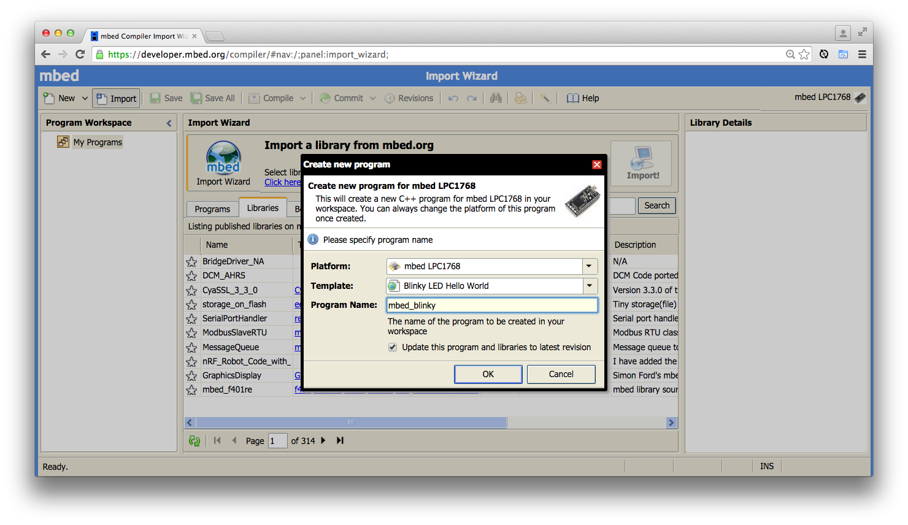
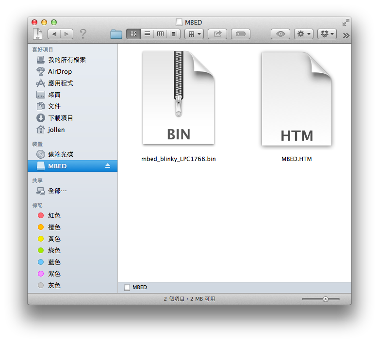

# 第 1 章：ARM mbed 起步走

## 歡迎來到 Web of Things 世界

在 IoT 的技發發展藍圖裡，描述了 IoT 的 4 個發展階段，其中第 4 個階段就是 WoT。而目前正好處於第 4 個 IoT 發展階段。Google 在 2014 年底發起的 Physical Web 計畫，是一個非常先期的研究計畫，就是為了 IoT 的新階段預做準備 [1]。

IoT 的第 4 個階段，將聚焦在 Advanced Sensor Fusion 與 Physical-World Web 層面，這二個層面簡單來說，就是 WoT。根據維期百科上的定義，WoT 是 IoT 的 Application Layer，並且是使用 Web 技術來打造 application。也就是說，IoT + Web-enabled technologies 就是 WoT。

目前有許多 ARM mbed 的開發板，這些開發板並不是「另一個 Arduino」硬體，而是更能符合 WoT 理念的 RESTful device。同樣的硬體，不同的觀念、技術框架與商業思維，能帶來不同的產品思維與商業模式。所以，ARM mbed 與 WoT 帶來的，將是一場新的革命與機會。

本書前 4 章是 ARM mbed 的入門學習。從第 5 章開始，將加入 REST device 觀念，透過一系列的創作與實習，帶給大家不一樣的 IoT 技術視野。

[1]: http://www.jollen.org/blog/2015/01/arm-mbed-1-physical-web.html

## 進入 Workspace

ARM mbed 的開發，必須使用 mbed.org 官方的 on-line compiler。將 LPC1786 與電腦連接後，進入 mbed.org 申請開發者帳號；進入 Compiler 環境後，可以看到圖 1.1 的 workspace。


圖 1.1：mbed 的 workspace

## "Hello, World"

依照以下步驟建立第一個 "Hello, World"：

1. 在 workspace 裡點選 *New -> New Program*
2. *Platform* 選取 mbed LPC1786
3. *Template* 選取 Blinky LED Hello World
4. *Program Name* 填寫自訂名稱
5. 按 *OK*



圖 1.2：New Program

mbed 提供許多 Program 與 Library 範本，這裡使用的是一個 LED 閃爍的程式碼範本。接著進行編譯與 firmware 更新：

1. 在 workspace 裡點選 *Compile -> Compile All*
2. 編譯成功後，會自動下載一個副檔名為 *.bin* 的 firmware
3. 將下載回來的 firmware 拷貝到 LPC1768 開發板

使用 Mac 環境的開發者，使用 USB 將 LPC1768 與電腦連接後，會看到 *MBED/* 資料夾，只要將 firmware 檔案拉到此資料裡即可，如圖 1.3。

4. 拔除並重接 USB 線，讓 LPC1786 重新關機。
5. 完成。可以看到 LPC1786 的 LED1 開始閃爍。



圖 1.3：Drag and Drop 更新 firmware

LPC1786 開發板有大量的 GPIO，可與各種 sensor device 結合，並透過演算法的實作，發展各式應用。

## 本書架構

ARM mbed 作業系統本身具備 networking feature（例如：3G、ethernet），因此不再只是扮演傳統 GPIO 控制，或是藍芽傳輸的角色；它可以透過 Websocket 連線，將 sensor data 推送（data push）給伺服器。ARM mbed 作業系統也提供 httpd library，能在 ARM mbed 裝置上發展 REST API，並透過 HTTP 讓 client 端呼叫。

基於 ARM mbed 作業系統的 LPC1768 開發板，如果只當做 GPIO 控制器來使用，就太可惜了。將 LPC1786 視為 physical object，才是 ARM mbed 作業系統的潛力所在。Physical object 就是 REST device 的觀念。

因此，本書的規劃，將列入 REST device 的主題。整體內容架構如圖 1.4。


mbed School 是本教材的計畫名稱，目標是共創一份 ARM mbed 開放教材。所有內容採 CC BY-NC-SA 授權聲明。

圖 1.4：本書架構

## 實習：跑馬燈

學會使用 mbed 的 online compiler 後，可以從基本的 GPIO 控制開始學習。這是一個控制 LPC1786 LED 燈的範例，請練習編譯並測試本範例。

```
#include "mbed.h"

DigitalOut myled1(LED1);
DigitalOut myled2(LED2);
DigitalOut myled3(LED3);
DigitalOut myled4(LED4);

unsigned int mask = 0x1;

int main() {
    wait(0.8);
    
    while(1) {    
        myled1 = mask & 0x1;
        myled2 = mask & 0x2;
        myled3 = mask & 0x4;
        myled4 = mask & 0x8;
        
        wait(0.2);
        
        mask = mask << 1;
        
        if (mask & 0x10) 
            mask = 0x1;
    }
}
```

範例程式下載網址：

```
http://developer.mbed.org/users/mbedschool/code/mbed_led_run/
```

請練習使用 online compiler 的匯入功能，將本範例匯入使用。

## 關於 mbed 作業系統

ARM mbed 是一個 full stack 作業系統，底層是一個 RTOS 作業系統核心。mbed RTOS 本身提供以下機制：

* Thread
* Mutex
* Semaphore
* Message Queue
* Mail
* Memory Poll

Mokoversity 農場計畫團隊，正在進行「國民飛行器」計畫。與 RTOS 有關的技術，將在「國民飛行器」計畫的分享課程裡說明。
