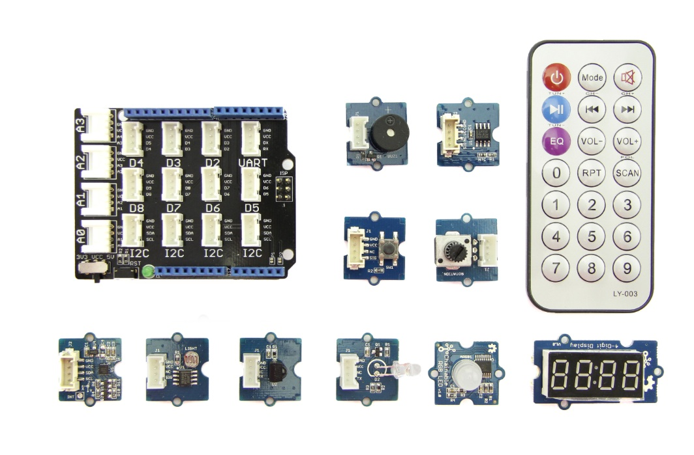

# 第 3 章：Sensor 模組

第 3 章開始，將使用一些常見的 sensor 模組，來實做一些 IoT 的概念。以下先總覽幾個常用的 sensor 模組。所有模組皆可在 Grove Starter Kit for mbed 套件裡取得。



圖 3.1：Seeed Studio 設計與生產的 Grove Starter Kit for mbed

以下是 Grove Starter Kit for mbed 裡的 sensor 模組簡介。

### Grove - Button

按鈕模組包含一顆獨立的「瞬間開/關」按鈕。「瞬間」是意思是，當按鈕被按壓後，按鈕會立刻主動反彈。按下按鈕時，按鈕模組會使 GPIO 腳位得到一個 High 信號，反彈時則輸出 LOW 信號。

範例：

使用 Button 控制 LED ，按鈕被按壓後 LED 亮，反彈時則 LED 不亮。
```
#include "mbed.h"

DigitalOut myled(LED1);
DigitalIn button(p21);

int main()
{
    while(1){

        if (button)
            myled = 1 ;          
        else
            myled = 0;   

         wait(0.7); // simple debouncing      
    }

}

```
### Grove - Buzzer

蜂鳴器（Buzzer）模組的主要元件，是一個壓電式蜂鳴器。可以將蜂鳴器連接到 LPC1786 的數位輸出（Digital Output），當輸出為 HIGH 時發出聲響。

亦可將蜂鳴器連接到類比輸出，此時可讓蜂鳴器產生各種音效。

範例：

使用 Button 控制蜂鳴器，按鈕被按壓後蜂鳴器發出聲響，反彈時則蜂鳴器無發出聲響。
```
#include "mbed.h"

DigitalOut Buzzer(p20);
DigitalIn button(p21);

int main()
{
    while(1){

        if (button)
            Buzzer = 1 ;          
        else
            Buzzer = 0;   

         wait(0.7); // simple debouncing      
    }

}

```

### Grove - Rotary Angle Sensor 

旋轉角度感測器模組提供類比輸出介於 0 - Vcc，可偵測角度為 0 - 300 度。

範例：

使用 AnalogIn API 讀取旋轉角度。
```
AnalogIn RotaryAngle(A3);

int main()
{
    int value = 0 ;
    value = RotaryAngle;
}
```

### Grove - Temperature Sensor

溫度感測器模組使用溫敏電阻偵測環境溫度。當環境溫度上升時，溫敏電阻值將會下降。我們可以利用這個特性去計算出環境溫度。
感測器可偵測的範圍是 -40ºC - 125ºC，誤差為 ±1.5ºC。

範例：

使用 AnalogIn API 讀取 Temperature Sensor 的資料，依 Temperature Sensor 的 datasheet 轉換出溫度。

```
#include "mbed.h"

AnalogIn devic(p15);

int a;
float temperature;
int B=3975;                                                         //B value of the thermistor
float resistance;

int main()
{
    while(1) {

        a = devic*675; // multiply ain by 675 if the Grove shield is set to 5V or 1023 if set to 3.3V
        resistance=(float)(1023-a)*10000/a;                         //get the resistance of the sensor;
        temperature=1/(log(resistance/10000)/B+1/298.15)-273.15;    //convert to temperature via datasheet ;
        
        wait(0.8);
        
    }
}

```

### Grove - Light Sensor

光源感測器模組包含一個光敏電阻。當環境光源的強度上升時，光敏電阻值將會下降。也就是說，光亮時輸出訊號為 HIGH，黑暗時為 LOW。

範例：

使用 Light Sensor 控制 LED ，光亮時 LED 不亮，無光亮時則 LED 亮。
```
#include "mbed.h"

DigitalOut myled(LED1);
DigitalIn lighter(p21);

int main()
{
    while(1){

        if(lighter == 1)
            myled = 0 ;          
        else
            myled = 1;   

         wait(0.2);   
    }

}

```
### Grove - Infrared Emitter

紅外線發射器模組，透過紅外線 LED 發射紅外線，可發射 10 米的紅外線訊號，超過 10 米，紅外線接收器可能接收不到訊號。

範例：

使用 Button 控制 Infrared Emitter ，按鈕被按壓後發射紅外線 { 0x80, 0x00 } 訊號，將 RemoteIR Library 匯入後，引入 *DigitDisplay.h* 標頭檔，來實做發射紅外線訊號。

```

#include "mbed.h"
#include "TransmitterIR.h"
TransmitterIR ir_tx(p21);
DigitalIn button(p22);

RemoteIR::Format format = RemoteIR::SONY;
uint8_t buf[] = { 0x80, 0x00 };
int bitcount = 12;
int main() {
    while(1){
        if (button){
            if (ir_tx.getState() == TransmitterIR::Idle) {
                bitcount = ir_tx.setData(format, buf, bitcount);
            }
        }
        wait(0.7); // simple debouncing 
        
    }
}
```

### Grove - Infrared Receiver

紅外線接收器模組，用來接收紅外線信號，可接收 10 米的紅外線信號，通常與紅外線發射器一起使用。

範例：

使用 RemoteIR Library，引入 *DigitDisplay.h* 標頭檔，來實做紅外線接收信號。
```

#include "mbed.h"
#include "ReceiverIR.h"
ReceiverIR ir_rx(p15);

RemoteIR::Format format;
uint8_t buf[32];
int bitcount;
int main() {
    while(1)
    {    
        if (ir_rx.getState() == ReceiverIR::Received) {
            bitcount = ir_rx.getData(&format, buf, sizeof(buf) * 8);
        }
    }
}
```

### Grove - Chainable RGB LED

全彩可變色 LED 模組，可透過程式改變 LED 顏色。

### Grove - 3-Axis Digital Accelerometer

數位三軸加速器模組，通常使用在需要偵測方向、手勢、動作的應用，能準確地反映物體的運動性質。

感測器本身會會回傳 0~63 的結果，我們可以透過此結果依表轉換成 G 值(1g=m/s^2)或者角度(不建議使用)，詳細對照表可參照[此文件](http://www.freescale.com.cn/files/sensors/doc/data_sheet/MMA7660FC.pdf?fpsp=1) P.26~P.27。


數據解析對照表

範例：

使用 MMA7660FC Library ，引入 *MMA7660FC.h* 標頭檔，來取得三軸加速器的數值，透過 G 值對照表轉換成 G 值。

```

#include "mbed.h"
#include "MMA7660FC.h"
 
#define ADDR_MMA7660 0x98                   // I2C SLAVE ADDR MMA7660FC
 
MMA7660FC Acc(p28, p27, ADDR_MMA7660);      //sda、cl、Addr，更換接角時請務必更改此處
Serial pc(USBTX, USBRX);

// G值對照表
float G_VALUE[64] = {0, 0.047, 0.094, 0.141, 0.188, 0.234, 0.281, 0.328, 0.375, 0.422, 0.469, 0.516, 0.563, 0.609, 0.656, 0.703, 0.750, 0.797, 0.844, 0.891, 0.938, 0.984, 1.031, 1.078, 1.125, 1.172, 1.219, 1.266, 1.313, 1.359, 1.406, 1.453, -1.500, -1.453, -1.406, -1.359, -1.313, -1.266, -1.219, -1.172, -1.125, -1.078, -1.031, -0.984, -0.938, -0.891, -0.844, -0.797, -0.750, -0.703, -0.656, -0.609, -0.563, -0.516, -0.469, -0.422, -0.375, -0.328, -0.281, -0.234, -0.188, -0.141, -0.094, -0.047};
 
 
int main() 
{
 
    Acc.init();                                                     // Initialization
    pc.printf("Value reg 0x06: %#x\n", Acc.read_reg(0x06));         // Test the correct value of the register 0x06
    pc.printf("Value reg 0x08: %#x\n", Acc.read_reg(0x08));         // Test the correct value of the register 0x08
    pc.printf("Value reg 0x07: %#x\n\r", Acc.read_reg(0x07));       // Test the correct value of the register 0x07
           
    while(1)
    {   
        float x=0, y=0, z=0;
        float ax=0, ay=0, az=0;
        
        Acc.read_Tilt(&x, &y, &z);                                  // Read the acceleration                    
        pc.printf("Tilt x: %2.2f degree \n", x);                    // Print the tilt orientation of the X axis
        pc.printf("Tilt y: %2.2f degree \n", y);                    // Print the tilt orientation of the Y axis
        pc.printf("Tilt z: %2.2f degree \n", z);                    // Print the tilt orientation of the Z axis
 
        wait_ms(100);
 
        pc.printf("x: %1.3f g \n", G_VALUE[Acc.read_x()]);          // Print the X axis acceleration
        pc.printf("y: %1.3f g \n", G_VALUE[Acc.read_y()]);          // Print the Y axis acceleration
        pc.printf("z: %1.3f g \n", G_VALUE[Acc.read_z()]);          // Print the Z axis acceleration
        pc.printf("\n");
        
        //換算成 G值
        ax = G_VALUE[Acc.read_x()];
        ay = G_VALUE[Acc.read_y()];
        az = G_VALUE[Acc.read_z()];
        
        wait(0.2);
          
    }
}
```
### 4 Digit Display

數字顯示器為顯示數字的電子元件。藉由 7 個 LED 以不同組合來顯示數字，所以稱為 7 段顯示器。4 位數字顯示器即可顯示 4 個數字，可當時鐘。

範例：
使用 DigitDisplay Library ，引入 *DigitDisplay.h* 標頭檔，來實做 4 位數字顯示器。
```
#include "mbed.h"
#include "DigitDisplay.h"

DigitDisplay display(p27, p28);
/**
 * RX pin - p27
 * TX pin - p28
 */

int main()
{
   display.write(30);
}

```

# 實作：溫度感測器搭配四位數顯示器

實作簡易環境溫度感測器並將即時監控的溫度顯示在 LED 數字顯示器上。

## 電子零件介紹

* Arch Pro 開發板 
* Base Shield 
* Grove Temperature 
* Grove 4-Digit-Display 
* Grove - Universal 4 Pin 20cm Unbuckled Cable


圖1：溫度感測器實作採用零件

## 溫度感測器實作步驟

* 將 Base Shield 接在 Arch Pro 上 
* 溫度感測器接 Universal 4 pin Cable 線，並接在 Base Shield 的 A0 
* 將四位數 LED 顯示器接 Universal 4 pin Cable 線，並接在 Base Shield 的 UART
* 記得將 Base Shield 切換至 5V VCC 


圖2：溫度感測器組裝完成圖

## 撰寫程式碼
使用 DigitDisplay  Library ，引入 *DigitDisplay.h* 標頭檔，來實做 4 位數字顯示器，將 Temperature Sensor 讀取到的值依 Temperature Sensor 的 datasheet 轉換後，顯示在 LED 數字顯示器上。
```
#include "mbed.h"
#include "DigitDisplay.h"

DigitalOut myled(LED2);

DigitDisplay display(P4_29, P4_28);
AnalogIn ain(P0_23);

int a;
float temperature;
int B=3975;                                                         //B value of the thermistor
float resistance;

int main()
{
    while(1) {
// multiply ain by 675 if the Grove shield is set to 5V or 1023 if set to 3.3V
        a=ain*675;
        resistance=(float)(1023-a)*10000/a;                         //get the resistance of the sensor;
        temperature=1/(log(resistance/10000)/B+1/298.15)-273.15;    //convert to temperature via datasheet ;
        myled = 1;
        wait(0.8);
        myled = 0;
        wait(0.8);
        display.write(temperature);
    }
}

```
## 即時溫度監控顯示畫面 

由程式碼定義 Arch Pro 的第二顆 LED 紅燈閃爍來簡易判斷是否有正常執行運作。

圖3：溫度監控即時顯示 LED 實作

## 參考資源
* http://developer.mbed.org/users/djbottrill/code/Grove_Thermometer/
