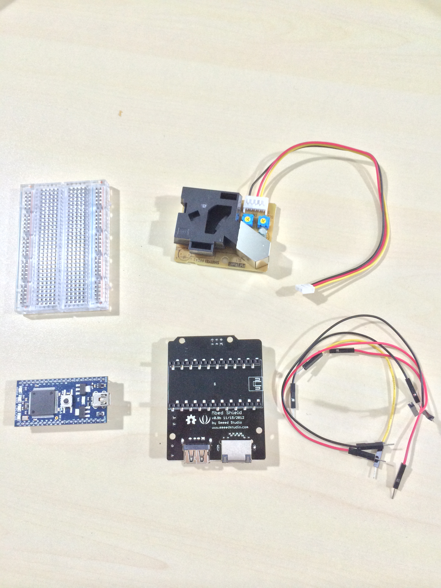
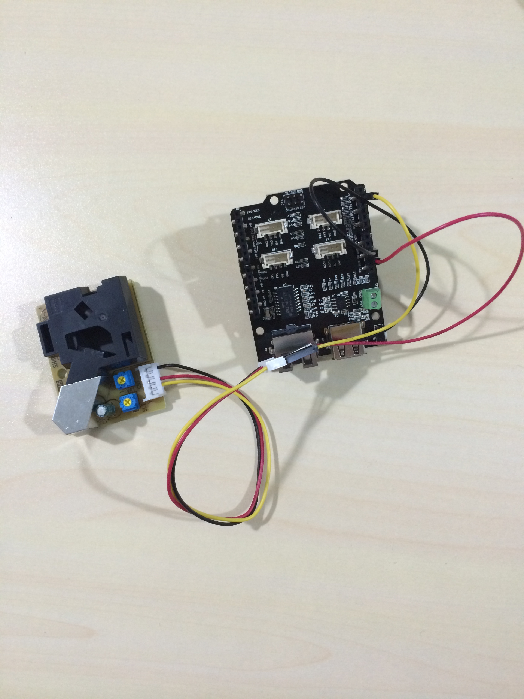

# 第 5 章：DIY 空氣品質偵測器

目前為止，已經具備以下的背景知識：

* ARM mbed 與 LPC1768 入門，基本 GPIO 控制
* ARM mbed 的 Network API，讓 LPC1768 上網

接著，就是 ARM mbed 的重點戲了：REST API。

要讓 ARM mbed 裝置具備 REST API 能力，最重要的就是練習撰寫 HTTPD 功能。ARM mbed 提供 HTTPD 程式庫，能在裝置上生成一個輕量級的 Web Server。

本章將介紹 HTTPD 的使用，並將 Dust Sensor 的即時數據封裝為 REST API。用戶可透過瀏覽器，即時取得 Dust Sensor 的數值。Dust Sensor 是空氣微粒的感測器，並不包含在 Grove Starter Kit for mbed 套件裡，需額外取得。

## 準備工作

### LPC1768 的 GPIO Pinout

LPC1768 的 GPIO（General purpose digital input/output）pin 共分為 Port 0、Port 1、Port 2、Port 3 四類。

Port 0 簡介：

* Port 0 代表編號 P0[0]～P0[31] 的所有 GPIO pin。

* Port 0 與 ARM mbed pin 的對應關係如下：

 * P0[0]：p9
 * P0[1]：p10
 * P0[2]： -
 * P0[3]： -
 * P0[4]：p30
 * P0[5]：p29
 * P0[6]：p8
 * P0[7]：p7
 * P0[8]：p6 
 * P0[9]：p5
 * P0[10]：p28
 * P0[11]：p27
 * P0[12]：N/A
 * P0[13]：N/A
 * P0[14]：N/A
 * P0[15]：p13
 * P0[16]：p14
 * P0[17]：p12
 * P0[18]：p11
 * P0[19]： -
 * P0[20]： -
 * P0[21]： -
 * P0[22]： -
 * P0[23]：p15
 * P0[24]：p16
 * P0[25]：p17
 * P0[26]：p18
 * P0[27]： -
 * P0[28]： -
 * P0[29]：USB+
 * P0[30]：USB-
 * P0[31]：N/A

“-”：表示沒有特殊對應之 ARM mbed pin，但仍為 GPIO pin。
“N/A“：表示 Not available。
 
* Port 0 是一個 32-bit 的 I/O port，每一個 bit 都能直接被控制。Port 0 所有 pin 的操作取決於 pin connect block 選出的功能。

* Port 0 的 P0[12]、P0[13]、P0[14]、P0[31] 這 4 支 pin 無法使用。


Port 1 簡介：

* Port 1 代表編號 P1[0]～P1[31] 的所有 GPIO pin。

* Port 1 與 ARM mbed pin 的對應關係如下：

 * P1[0]： -
 * P1[1]： -
 * P1[2]：N/A
 * P1[3]：N/A
 * P1[4]： -
 * P1[5]：N/A
 * P1[6]：N/A
 * P1[7]：N/A
 * P1[8]： -
 * P1[9]： -
 * P1[10]： -
 * P1[11]：N/A
 * P1[12]：N/A
 * P1[13]：N/A
 * P1[14]： -
 * P1[15]： -
 * P1[16]： -
 * P1[17]： -
 * P1[18]：LED1
 * P1[19]： - 
 * P1[20]：LED2 
 * P1[21]：LED3 
 * P1[22]： - 
 * P1[23]：LED4
 * P1[24]： -
 * P1[25]： -
 * P1[26]： -
 * P1[27]： - 
 * P1[28]： -
 * P1[29]： - 
 * P1[30]：p19
 * P1[31]：p20

“-”：表示沒有特殊對應之 ARM mbed pin，但仍為 GPIO pin。
“N/A“：表示 Not available。

* Port 1 是一個 32-bit 的 I/O port，每一個 bit 都能直接被控制。Port 1 所有 pin 的操作取決於 pin connect block 選出的功能。

* Port 1 的 P1[2]、P1[3]、P1[5]、P1[6]、P1[7]、P1[11]、P1[12]、P1[13] 這 8 支 pin 無法使用。


Port 2 簡介：

* Port 2 代表編號 P2[0]～P2[31] 的所有 GPIO pin。

* Port 2 與 ARM mbed pin 的對應關係如下：

 * P2[0]：p26 
 * P2[1]：p25 
 * P2[2]：p24
 * P2[3]：p23
 * P2[4]：p22 
 * P2[5]：p21
 * P2[6]： -
 * P2[7]： -
 * P2[8]： - 
 * P2[9]： - 
 * P2[10]： -
 * P2[11]： -
 * P2[12]： -
 * P2[13]： -
 * P2[14]：N/A 
 * P2[15]：N/A 
 * P2[16]：N/A 
 * P2[17]：N/A 
 * P2[18]：N/A
 * P2[19]：N/A 
 * P2[20]：N/A
 * P2[21]：N/A
 * P2[22]：N/A 
 * P2[23]：N/A
 * P2[24]：N/A 
 * P2[25]：N/A 
 * P2[26]：N/A 
 * P2[27]：N/A 
 * P2[28]：N/A 
 * P2[29]：N/A 
 * P2[30]：N/A
 * P2[31]：N/A

“-”：表示沒有特殊對應之 ARM mbed pin，但仍為 GPIO pin。
“N/A“：表示 Not available。

* Port 2 是一個 32-bit 的 I/O port，每一個 bit 都能直接被控制。Port 2 所有 pin 的操作取決於 pin connect block 選出的功能。

* Port 2 的 P2[14]～P2[31] 這 18 支 pin 無法使用。


Port 3 簡介：

* Port 3 代表編號 P3[0]～P3[31] 的所有 GPIO pin。

* Port 3 與 ARM mbed pin 的對應關係如下：

 * P3[0]：N/A
 * P3[1]：N/A
 * P3[2]：N/A
 * P3[3]：N/A
 * P3[4]：N/A
 * P3[5]：N/A
 * P3[6]：N/A 
 * P3[7]：N/A
 * P3[8]：N/A 
 * P3[9]：N/A 
 * P3[10]：N/A 
 * P3[11]：N/A 
 * P3[12]：N/A 
 * P3[13]：N/A 
 * P3[14]：N/A
 * P3[15]：N/A
 * P3[16]：N/A
 * P3[17]：N/A
 * P3[18]：N/A
 * P3[19]：N/A
 * P3[20]：N/A
 * P3[21]：N/A
 * P3[22]：N/A
 * P3[23]：N/A
 * P3[24]：N/A
 * P3[25]： -
 * P3[26]： -
 * P3[27]：N/A
 * P3[28]：N/A
 * P3[29]：N/A
 * P3[30]：N/A
 * P3[31]：N/A

“-”：表示沒有特殊對應之 ARM mbed pin，但仍為 GPIO pin。
“N/A“：表示 Not available。

* Port 3 是一個 32-bit 的 I/O port，每一個 bit 都能直接被控制。Port 3 所有 pin 的操作取決於 pin connect block 選出的功能。

* Port 3 的 P3[0]～P3[24]，P3[27]～P3[31] 這 30 支 pin 無法使用。


### 電子零件介紹

準備材料如下：

1. ARM mbed LPC1768 開發版
2. mbed shield
3. 紅色導線 x 1，黑色導線 x 1，黃色導線 x 1
4. Grove - Dust Sensor x 1


圖 5.1：本章節使用的零件

## Grove - Dust Sensor 特性介紹

當空氣中的顆粒物進入 Dust sensor 時，顆粒物本身的大小、單位時間內進入的數量會影響感測器的電壓狀態，造成一小段時間維持在低電壓。所以在我們指定的某一段測量時間裡，藉由每一次低電壓脈衝佔用的時間，可以計算出空氣中顆粒物的濃度，檢測出空氣品質。此感測器可檢測出直徑 > 1μm 的顆粒。

## Dust Sensor 硬件原型製作

步驟如下：

1. 將 ARM mbed LPC1768 開發版插在 mbed shield（須依照 mbed shield 上的圖示方向）。
2. 將黃色導線之一端接在 Grove - Dust Sensor 的黃色母頭端，黃色導線另一端接在 mbed shield P5～P30 DigitalIn 任一腳位上，除了 P19、P20 腳位。
3. 將紅色導線之一端接在 Grove - Dust Sensor 的紅色母頭端，紅色導線另一端接在 mbed shield 5V 腳位上。
4. 將黑色導線之一端接在 Grove - Dust Sensor 的黑色母頭端，黑色導線另一端接在 mbed shield GND 腳位上。
5. 完成！


圖 5.2：空氣品質偵測器的原型

## Lightweight Web Server

1. 匯入 EthernetInterface Library ，引入 *EthernetInterface.h* 標頭檔，來設定網路組態
2. 匯入 HTTPD Library ，引入 *HTTPD.h* 標頭檔，來實做Http Web Server
3. 撰寫程式碼

```
#include "mbed.h"
#include "EthernetInterface.h"
#include "HTTPD.h"

EthernetInterface *eth;
HTTPD *httpd;

Serial pc(USBTX, USBRX);
InterruptIn probe(p8);
LocalFileSystem local("local");
DigitalOut led1(LED1), led2(LED2);
Timer timer;
Ticker ticker;

uint32_t low_time = 0;

void down();
void up();

void tick() {
    pc.printf("%d us, %f %%\r\n", low_time, low_time / (30.0 * 1000000));
    low_time = 0;
}
 
void down() {
    probe.rise(&up);
    led1 = 0;
    timer.start();
}

void up() {
    led1 = 1;
    timer.stop();
    probe.fall(&down);
    
    low_time += timer.read_us();
    timer.reset();
}

void callback_api(int id) {
    int i, n;
    char low_time_buf[256];
    char buf[256];
    
    sprintf( low_time_buf, "%f", low_time / (30.0 * 1000000));
    strcpy(buf, "{"); 
    strcat(buf, "success: true,");
    strcat(buf, "data: {");
    strcat(buf, "lowpulseoccupancytime: ");
    strcat(buf, low_time_buf);
    strcat(buf, "}");
    strcat(buf, "}");

    n = strlen(buf);
    i = httpd->receive(id, &buf[n], sizeof(buf) - n);
    if (i < 0) return;
    i += n;
    buf[i] = 0;
    printf("API %d %s\r\n", id, buf);
    httpd->send(id, buf, i, "Content-Type: text/plain\r\n");
}

int main() {
    pc.baud(115200);
    pc.printf("Dust Sensor test\r\n");
    probe.fall(&down);
    ticker.attach(tick, 30);
    
    printf("HTTP Server...\r\n");

    eth = new EthernetInterface;
    eth->init("192.168.21.81", "255.255.255.0", "192.168.21.2" );

    if (eth->connect()) return -1;

    printf("IP Address is %s\r\n", eth->getIPAddress());
    httpd = new HTTPD;
    httpd->attach("/1/mbed/lpc1768/sensor/dust/sen12291p", &callback_api);
    httpd->attach("/", "/local/");
    httpd->start(80);
    printf("httpd ready\r\n");
    led2 = 1;  
}

```


圖 5.3： Web server 測試成功

這個程式碼範例是以 Static IP 的方式設定 Ethernet，未來會加入以 DHCP 設定 Ethernet 的方式。

## REST API 設計

本章所設計的空氣品質偵測器，將以 REST API 方式提供 sensor data。基本觀念：

1. 需移植一個 httpd 至 LPC1768
2. 需要製作一個 frontend
3. Frontend 以 data pull 方式調用空氣品質偵測器的 REST API
4. 當 REST API 被調用時，再即時讀取空氣指數，並以 JSON 格式返回數據

這個設計當有幾個技術議題，未來將會加強：

1. Sensor device 應以 data push 方式，即時推送 sensor data


### 取得空氣指數

REST API 定義：

```
GET /1/mbed/lpc1768/sensor/dust/sen12291p
```

JSON 回傳資料格式：

```
{
	success: true
	data: {

	}
}
```
